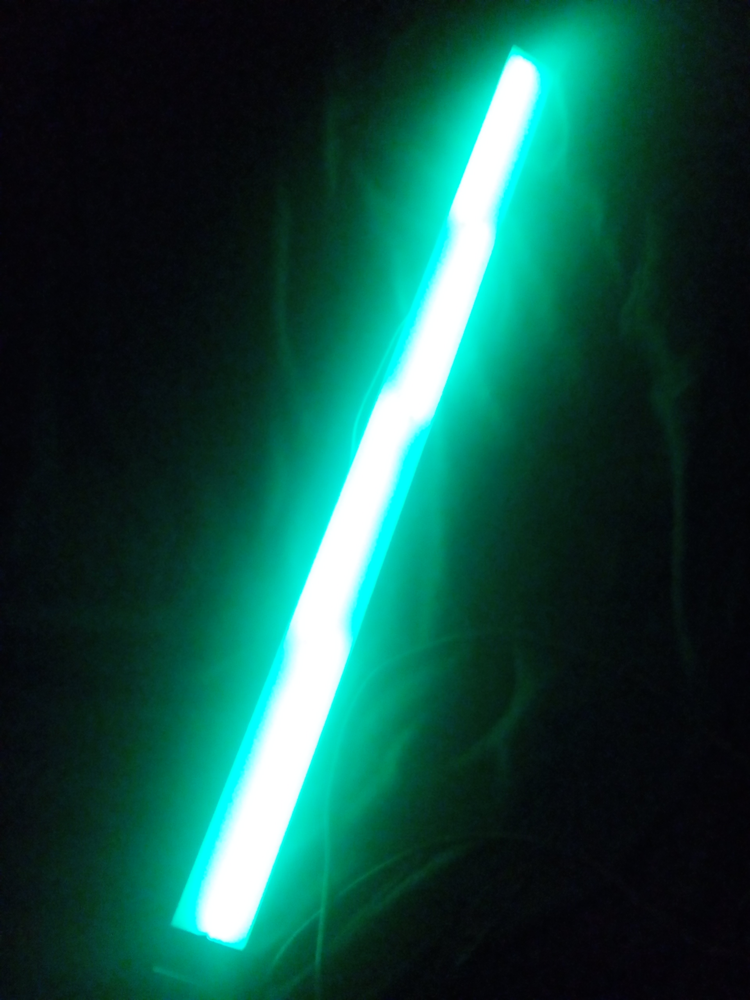

# Mote Light Painting
Using pimoroni motes to lightpaint bitmap images.


Inspired by 

* the [Pixel Stick](http://thepixelstick.com/) which is around $350
* the fact I have a full [Mote](https://shop.pimoroni.com/products/mote) kit that [Pimoroni](https://shop.pimoroni.com/) very kindly gave me for my 40th birthday and Motes are "Sticks of Pixels"


## Requirements

### Software

```bash
sudo aptitude install gphoto2 libgphoto2-dev git python-pip python-tk python-gtk2

sudo pip install webcolors pillow pygubu mote gphoto2

git clone https://github.com/EduMake/mote_light_painting.git

cd mote_light_painting
```

### Hardware

So far being built for :-

* Linux Machines
	* Ideally Raspberry Pi 3 but I'm running it on my Linux Mint Laptop
* Mote https://shop.pimoroni.com/products/mote
* Canon EOS 1200D (optional) - Should work with most EOS models and most cameras gphoto2 can control. Nothing clever just triggering shutter release with the settings you have set on the camera.





### Other Hardware

* Perspex stick, cut from  [this svg file](mote_light_painting_stick.svg)
* Screws to attach Mote sticks to the stick
* If using Raspberry Pi - USB Battery Pack


## Usage

If you are going to attach a Camera by USB make sure you have a "LightPaintings" folder in the same folder as the mote_light_painting folder.

```bash
sudo ./mote_light_painting.py
```


* Choose a file (there is a nice default spectrum if you are just testing)
* A message displays how wide the image should be (in cm)
* The Graph shows your image as 64 pixels (the height of a full set of motes) over the draw time (so it will usually look stretched, don't worry its a graph) 
* We often end up needing to ignore pure white pixels, if you need them painting check the 'Paint White ?' box. At the moment you need to reload the file.
* Ticking 'Control Camera' will try to capture a photo from you USB / PTP camera via gphoto2 (there is no error checking here at the mo, so if it freezes start again).
* "Delay Time" is self explanatory.
* "Draw Time" is how long it will take for your image to be drawn and will depend on the exposure time you are using.
* "Repeats" set how many times the Delay/Draw cycle takes place. This should allow for nice light painted / stop motion effects.
* "Colour" lets you choose a single colour to paint with.
* "End Colour" and the tick box allow you to set a changing colour pattern
* The "Pixels" slider lets you change the height of your light brush.
* Orientation controls
  * "Paint From Left" - The painting starts on the painter left (should not effect the orientation of the painter image) 
  * "Facing" - The screen is Facing the painter so the graph move the same way the painter does
  * "Flip" - Reverse the image 

* The "Draw" button :-
  * Blanks the Graph
  * Waits for any delay, drawing the progress on the Graph
  * Starts the camera's shot if 'Control Camera' is selected 
  * Starts changing the lights. 
  * Move the lights across the field of view of the camera. The Graph will redraw to give you a clue how far along you are.
  * If you have an animated gif file selected it will try to load the next frame.
  * The Draw process "Repeats" until it should end
  * On the last repeat, if 'Control Camera' is selected the image should pop up in a photo viewer


